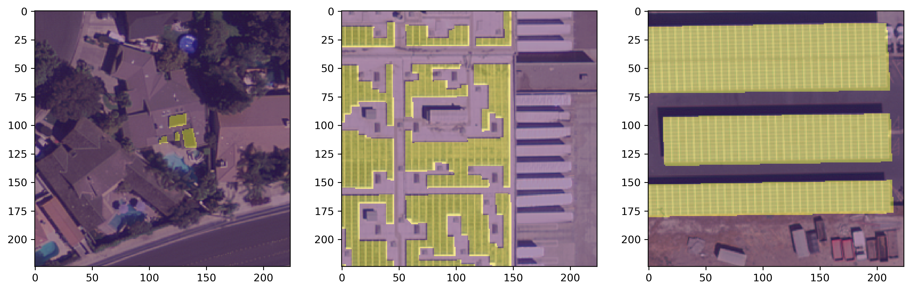
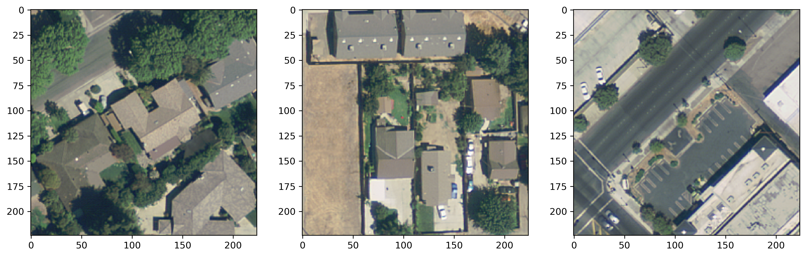

# Finding Solar Panel Farms in Massachusetts 

This model is modified and developed from [solar-panel-segmentation](https://github.com/gabrieltseng/solar-panel-segmentation).

## 1. Introduction

This repository leverages the [distributed solar photovoltaic array location and extent dataset for remote sensing object identification](https://www.nature.com/articles/sdata2016106)
to train a segmentation model which identifies the locations of solar panels from satellite imagery.

Training happens in two steps:

1. Using an Imagenet-pretrained ResNet34 model, a classifier is trained to identify whether or not solar panels are present
in a `[224, 224]` image.
2. The classifier base is then used as the downsampling base for a U-Net, which segments the images to isolate solar panels. 

## 2. Results

Here is the output of prediction image.


## 3. Pipeline

The main entrypoint into the pipeline is [`run.py`](solarnet/run.py). Note that each component reads files from the 
previous step, and saves all files that later steps will need, into the [`data`](data) folder.

In order to run this pipeline, follow the instructions in the [data readme](data/README.md) to download the data.

[Python Fire](https://github.com/google/python-fire) is used to generate command line interfaces.

#### 3.1. Make masks

This step goes through all the polygons defined in `metadata/polygonVertices_PixelCoordinates.csv`, and constructs masks
for each image, where `0` indicates background and `1` indicates the presence of a solar panel.

```bash
python run.py make_masks
```
This step takes quite a bit of time to run. Using an `AWS t2.2xlarge` instance took the following times for each city:

- Fresno: 14:32:09
- Modesto: 41:48
- Oxnard: 1:59:20
- Stockton: 3:16:08

#### 3.2. Split images

This step breaks the `[5000, 5000]` images into `[224, 224]` images. To do this, [`polygonDataExceptVertices.csv`](data/metadata/polygonDataExceptVertices.csv)
is used to identify the centres of solar panels. This ensures the model will see whole solar panels during the segmentation step.

Negative examples are taken by randomly sampling the image, and ensuring no solar panels are present in the randomly sampled example.

```bash
python run.py split_images
```

This yields the following images (examples with panels above, and without below):





#### 3.3. Train classifier

This step trains and saves the classifier. In addition, the test set results are stored for future analysis.

```bash
python run.py train_classifier
```

#### 3.4. Train segmentation model

This step trains and saved the segmentation model. In addition, the test set results are stored for future analysis.
By default, this step expects the classifier to have been run, and will try to use it as a pretrained base.
```bash
python run.py train_segmenter
```

Both models can be trained consecutively, with the classifier automatically being used as the base of the segmentation
model, by running
```bash
python run.py train_both
```

## 4. Setup

[Anaconda](https://www.anaconda.com/download/#macos) running python 3.7 is used as the package manager. To get set up
with an environment, install Anaconda from the link above, and (from this directory) run

```bash
conda env create -f environment.{mac, ubuntu.cpu}.yml
```
This will create an environment named `solar` with all the necessary packages to run the code. To 
activate this environment, run

```bash
conda activate solar
```

This pipeline can be tested by running `pytest`.

[Docker](https://www.docker.com/) can also be used to run this code. To do this, first build the docker image:

```bash
docker build -t solar .
```

Then, use it to run a container, mounting the data folder to the container:

```bash
docker run -it \
--mount type=bind,source=<PATH_TO_DATA>,target=/solar/data \
solar /bin/bash
```
