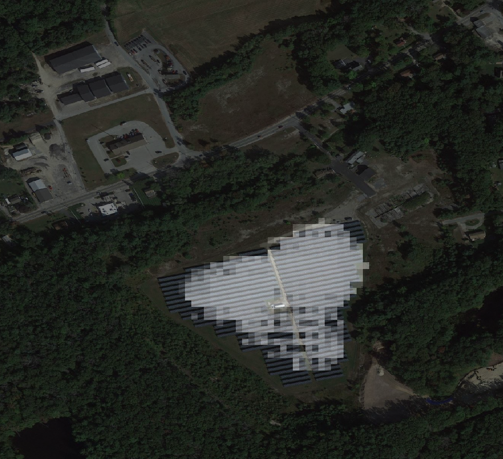
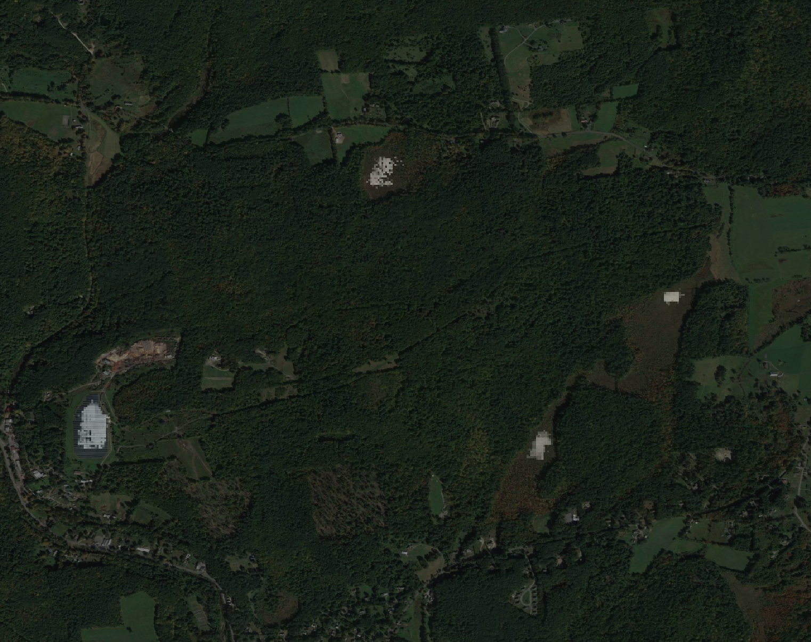
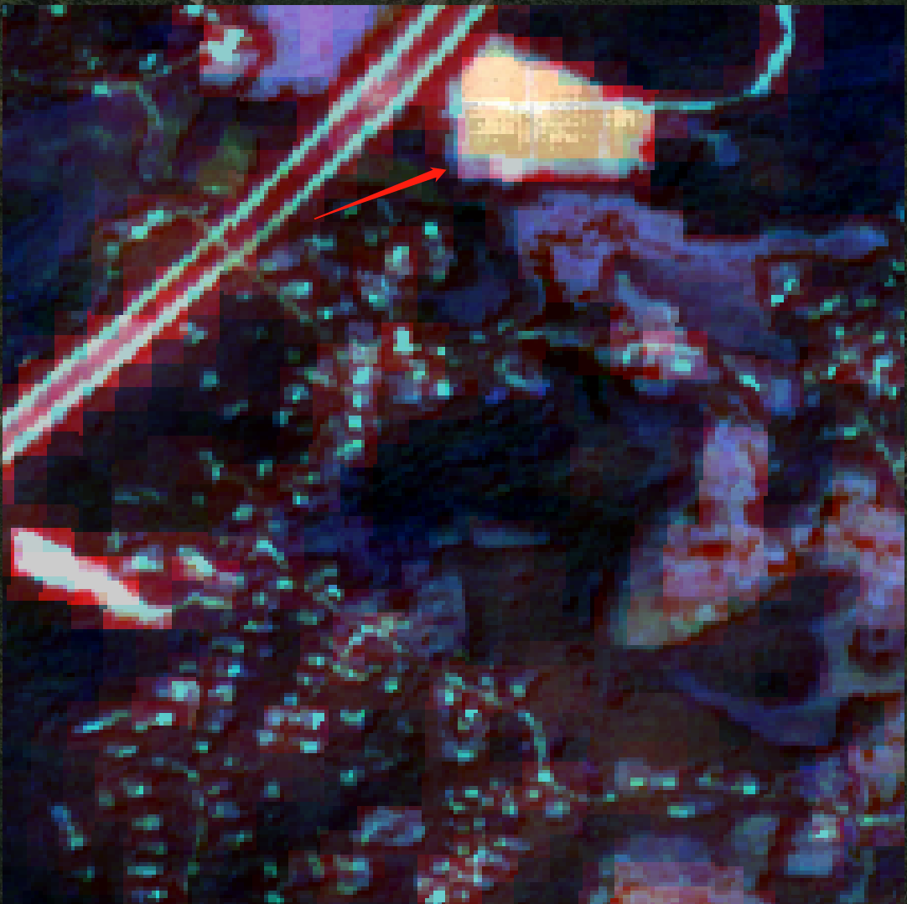
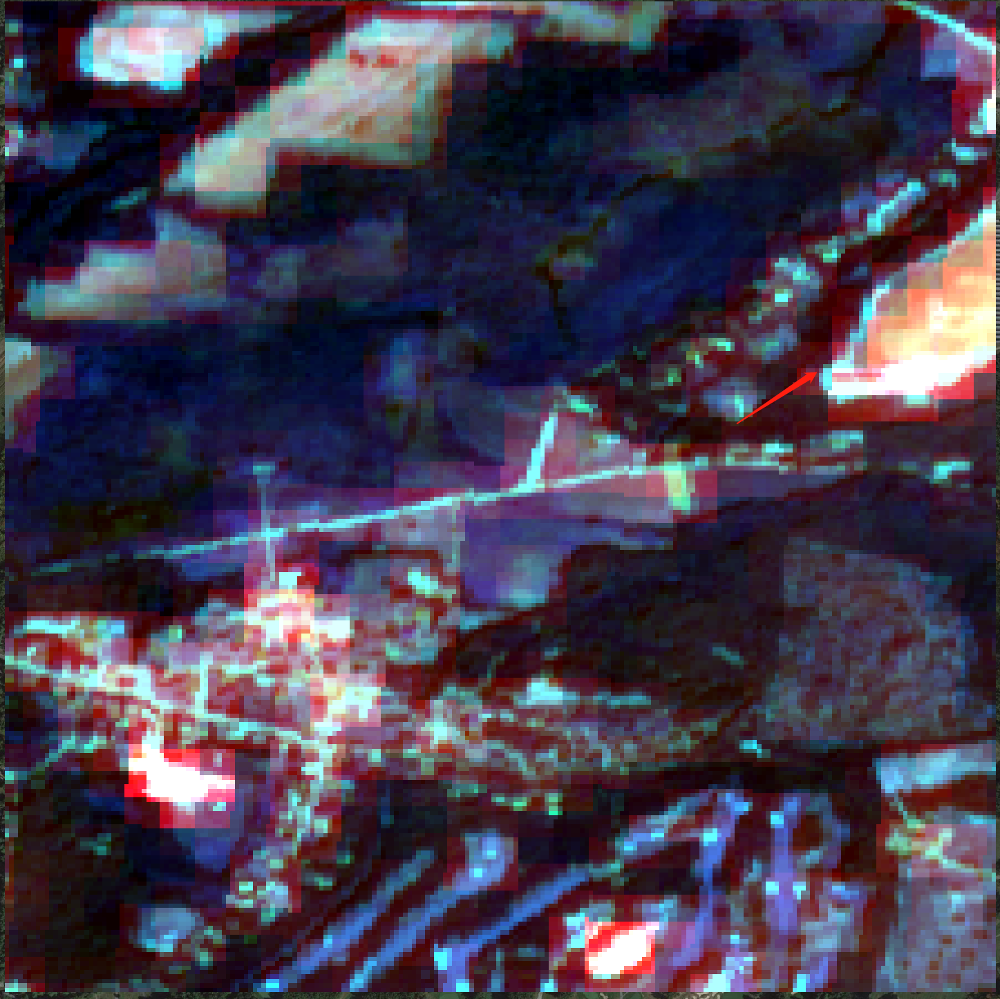
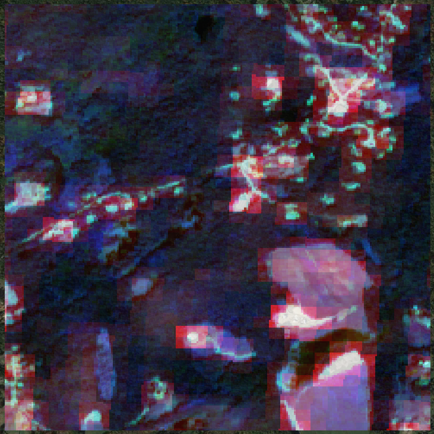
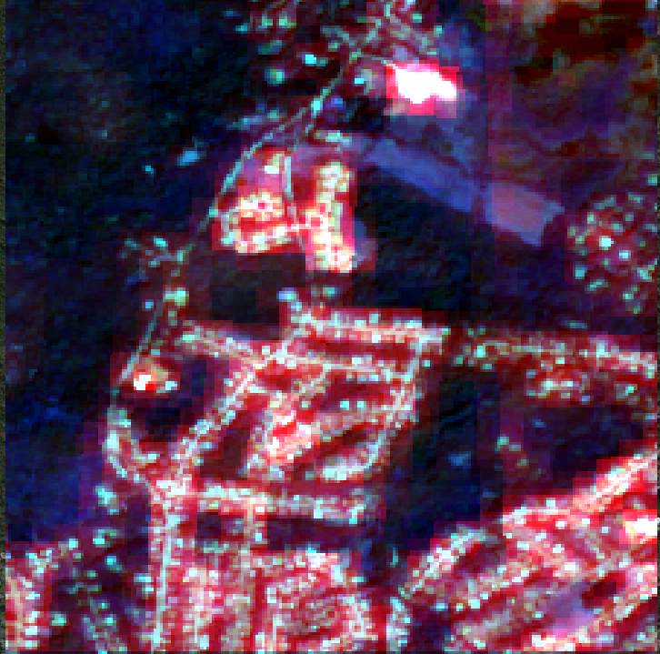

# Finding Solar Panel Farms in Massachusetts 

This model is modified and developed from [solar-panel-segmentation](https://github.com/gabrieltseng/solar-panel-segmentation).

## 1. Introduction

This repository leverages the [distributed solar photovoltaic array location and extent dataset for remote sensing object identification](https://www.nature.com/articles/sdata2016106)
to train a segmentation model which identifies the locations of solar panels from satellite imagery.

Training happens in two steps:

1. Using an Imagenet-pretrained ResNet34 model, a classifier is trained to identify whether or not solar panels are present
in a `[224, 224]` image.
2. The classifier base is then used as the downsampling base for a U-Net, which segments the images to isolate solar panels. 

## 2. Results

Here is the output of prediction image.

 
 

## 3. Pipeline

The main entrypoint into the pipeline is [`run.py`](solarnet/run.py). Note that each component reads files from the 
previous step, and saves all files that later steps will need, into the [`data`](data) folder.

In order to run this pipeline, follow the instructions in the [data readme](data/README.md) to download the data.

[Python Fire](https://github.com/google/python-fire) is used to generate command line interfaces.


#### 3.1. Split images and make masks

This step breaks the downloaded Sentinel-2 images into `[224, 224]` chips. To do this,[`make_chips.py`](make_chips.py) is used for spliting images and creating label images. Inside the code, change the paths as following:

```bash
i = MakeChips('the path to the downloaded Sentinel Image')
i.chip_format = 'tif' # choose 'tif' or 'npy' will produce chips with corresponding format
i.read_polygons('the path to the solar panel vector data')
# create following folders
i.set_outfolder_bands('../data/processed/all_org')
i.set_outfolder_bands_yes('../data/processed/solar/org')
i.set_outfolder_bands_no('../data/processed/empty/org')
i.set_outfolder_label_yes('../data/processed/solar/mask')
i.set_outfolder_label_no('../data/processed/empty/mask')
```

run the file below:

```bash
python make_chips.py
```

This yields the following images (examples with panels above, and without below):






#### 3.2. Train classifier

This step trains and saves the classifier. In addition, the test set results are stored for future analysis.

```bash
python run.py train_classifier
```

#### 3.3. Train segmentation model

This step trains and saved the segmentation model. In addition, the test set results are stored for future analysis.
By default, this step expects the classifier to have been run, and will try to use it as a pretrained base.
```bash
python run.py train_segmenter
```

Both models can be trained consecutively, with the classifier automatically being used as the base of the segmentation
model, by running
```bash
python run.py train_both
```

#### 3.4. Predict solar panel images


## 4. Setup

[Anaconda](https://www.anaconda.com/download/#macos) running python 3.7 is used as the package manager. To get set up
with an environment, install Anaconda from the link above, and (from this directory) run

```bash
conda env create -f environment.{mac, ubuntu.cpu}.yml
```
This will create an environment named `solar` with all the necessary packages to run the code. To 
activate this environment, run

```bash
conda activate solar
```

This pipeline can be tested by running `pytest`.

[Docker](https://www.docker.com/) can also be used to run this code. To do this, first build the docker image:

```bash
docker build -t solar .
```

Then, use it to run a container, mounting the data folder to the container:

```bash
docker run -it \
--mount type=bind,source=<PATH_TO_DATA>,target=/solar/data \
solar /bin/bash
```
